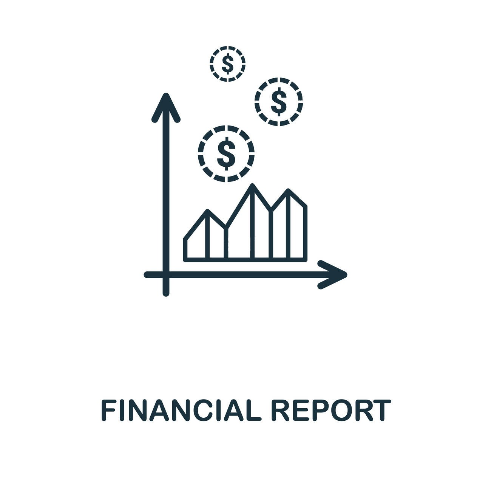

# Building Financial Report

### Project Overview
This project involves analyzing financial data from two datasets, Balance_Sheet.xlsx and Income_Statement.xlsx, which have been merged into a single dataset named df_ratios. The goal is to perform an Exploratory Data Analysis (EDA) to derive insights and provide recommendations.

### Datasets
    Balance_Sheet.xlsx
        - Contains financial information from the balance sheet of various companies.
        - Columns include: Company, comp_type, Year, Accounts Payable, Cash, Inventory, Property Plant Equipment, Short Term Investments, Total Assets, Total Current Assets, Total - Current Liabilities, Total Liab, Total Stockholder Equity.
    Income_Statement.xlsx
        - Contains financial information from the income statement of various companies.
        Columns include: Company, comp_type, Year, Cost Of Goods Sold, Gross Profit, Operating Income, Total Operating Expenses, Total Revenue.
    df_ratios
        - A merged dataset combining information from Balance_Sheet.xlsx and Income_Statement.xlsx.
        - Columns include: Unnamed: 0_x, Year, comp_type, company, Accounts Payable, Cash, Inventory, Property Plant Equipment, Short Term Investments, Total Assets, Total Current   Assets, Total Current Liabilities, Total Liab, Total Stockholder Equity, Unnamed: 0_y, Cost Of Goods Sold, Gross Profit, Operating Income, Total Operating Expenses, Total  Revenue, profitability_ratio, leverage_ratio.
### Exploratory Data Analysis (EDA)
## General Overview
    Number of Rows and Columns: (Provide the count after running the code)
    Data Types: (List the data types of each column)
    Missing Values: (Summarize missing values found in the dataset)
## Statistical Summary
    Summary Statistics: (Include key statistics like mean, median, standard deviation, min, max for numerical columns)
## Frequency Distribution
    Company Types: (Frequency distribution of comp_type)
    Years: (Frequency distribution of Year)
    Companies: (Frequency distribution of company)
## Correlation Analysis
    Correlation Matrix: (Provide insights from the correlation matrix)
## Visual Analysis
    Distribution Plots: (Summarize the distribution of key numerical columns)
    Count Plots: (Summarize the distribution of comp_type and Year)
    Correlation Heatmap: (Highlight key correlations)
    Pair Plots: (Describe any notable relationships observed in pair plots)

### Recommendations
Based on the EDA, the following recommendations are made:

Data Completeness:

Address any missing values to ensure data quality. Options include imputation, interpolation, or removal of missing data, depending on the context and amount of missing data.
Outliers:

Identify and investigate outliers. Determine if they are data entry errors, exceptional cases, or if they require further business context. Handle outliers appropriately.
Industry-Specific Insights:

Compare key financial metrics across different industries (comp_type). For example, analyze how Total Revenue, Gross Profit, and Total Assets differ between tech, FMCG, and real estate companies.
Time-Series Analysis:

Explore trends over the years for important financial ratios and metrics. Identify any significant changes or trends in financial performance.
Correlation and Causation:

Focus on highly correlated variables. Investigate if there is any causal relationship or if they are just coincidental correlations.
### Conclusion
The EDA provides a comprehensive understanding of the financial data, helping to identify patterns, anomalies, and derive actionable insights. These insights can inform strategic decisions and improve financial performance analysis.